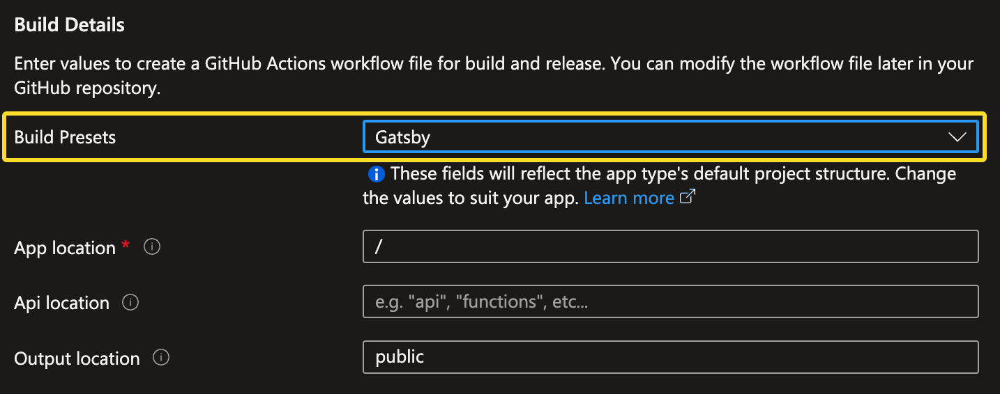
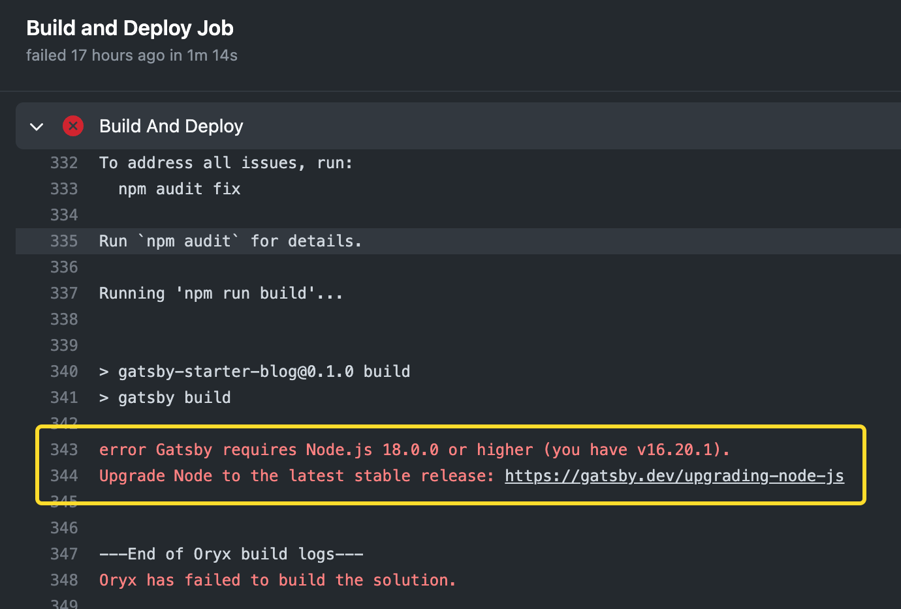
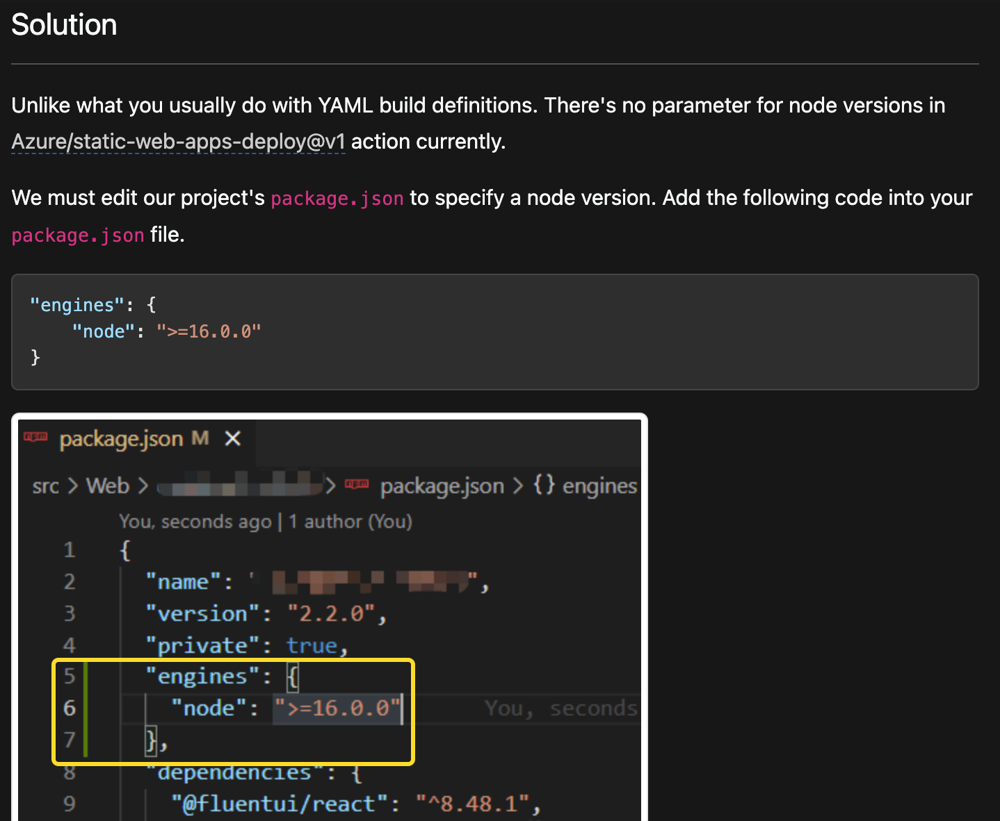
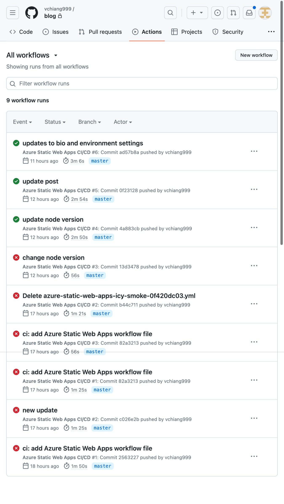
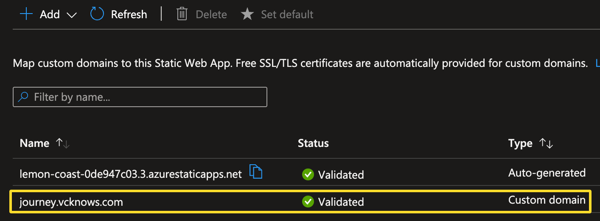

#### Summary: In this journey, I learned that nothing comes easy. When faced with challenges, it is essential to remain determined and proactive. Instead of getting discouraged, I embraced the obstacles and sought out solutions to overcome them. This experience serves as a reminder that with perseverance and a resourceful approach, any obstacle can be surmounted.

Now that I have successfully launched my Online CV, my next endeavor is to start a blog, wherein I will document the challenges encountered throughout this learning journey, along with the corresponding solutions I discovered during my research.

Since Azure Static Web App solely provides hosting without any server side processing involved, it is essential for me to find a blog solution that is lightweight and easy to maintain. This is where Gatsby comes into the picture.

Microsoft has a well documented module which guides you through the process.
[Create and publish a static web app with Gatsby and Azure Static Web Apps](https://learn.microsoft.com/en-us/training/modules/create-deploy-static-webapp-gatsby-app-service/)

```
Packages required:
- node
- npm
- gatsby-cli
```

Installing these packages was not straightforward. However, I subsequently discovered a guide that utilizes [Homebrew](https://brew.sh/), which, in my opinion, offers a significantly easier method for installing and updating packages.

Creating the Azure Static Web App was a straightforward process, with the crucial decision being the selection of Gatsby in the **Build Presents** options.


Upon committing and pushing the codes to GitHub, which triggers the **Action** on Azure, I encountered the following error: "**Node version too low.**"


A quick search yielded a [solution](https://edi.wang/post/2022/1/27/how-to-specify-nodejs-version-when-building-azure-static-web-app) to use the latest version of node.


Finally, success! Welcome to my Blog!


The last thing to do now is to add a custom domain.
