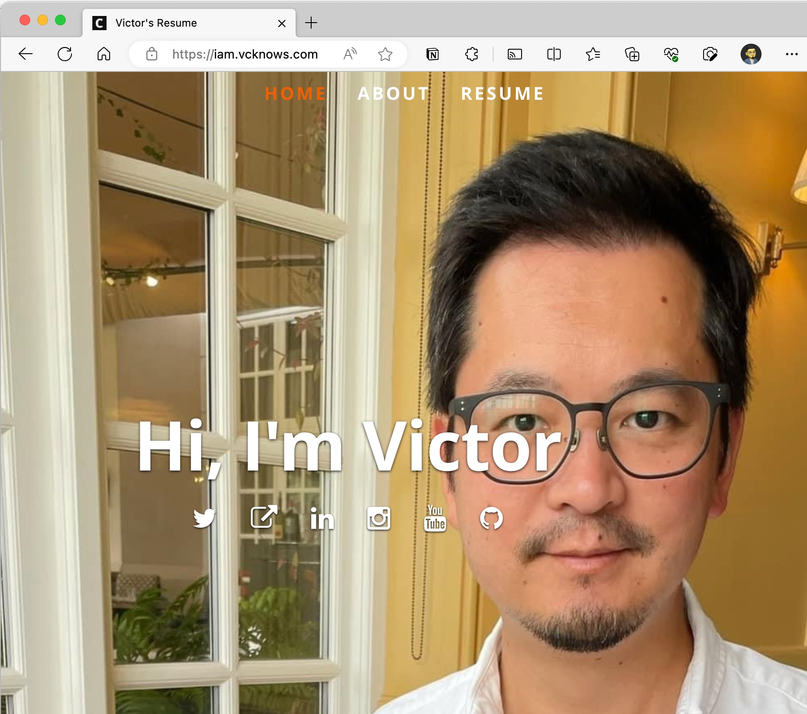
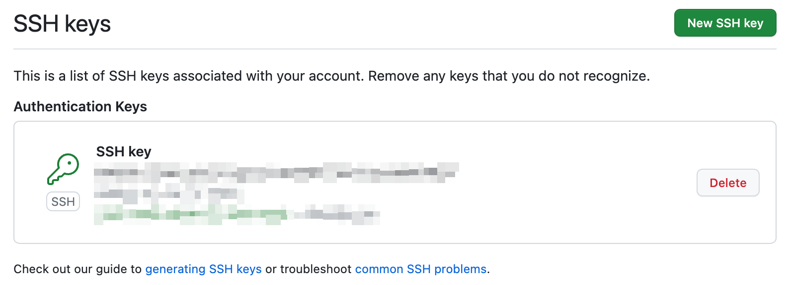
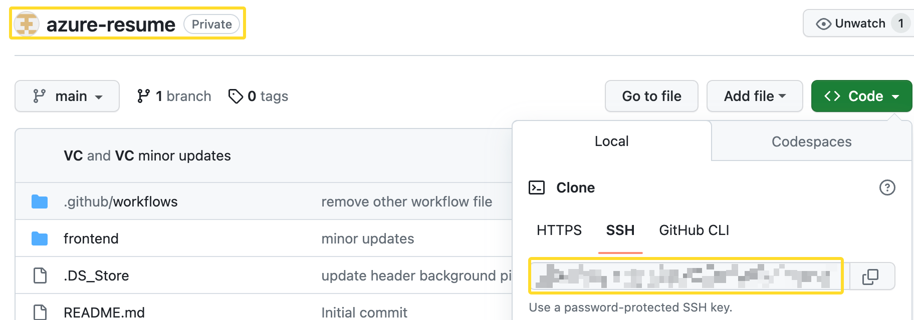
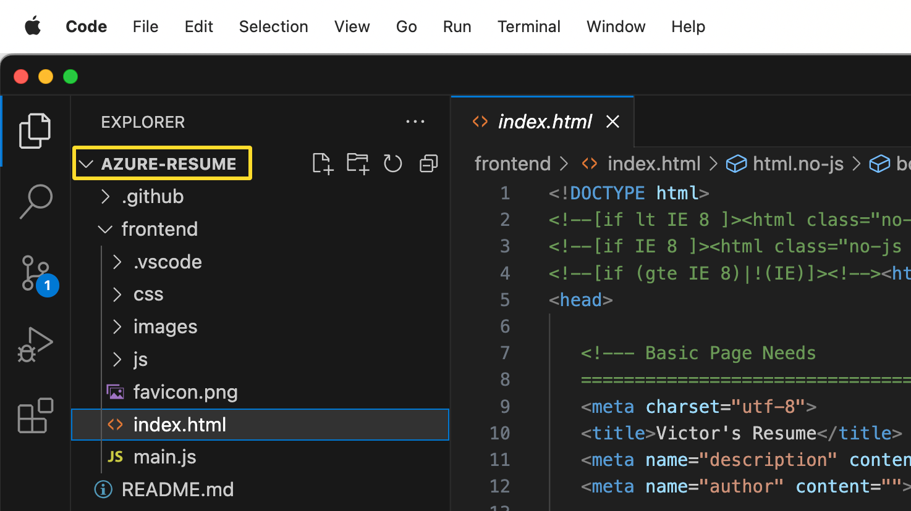
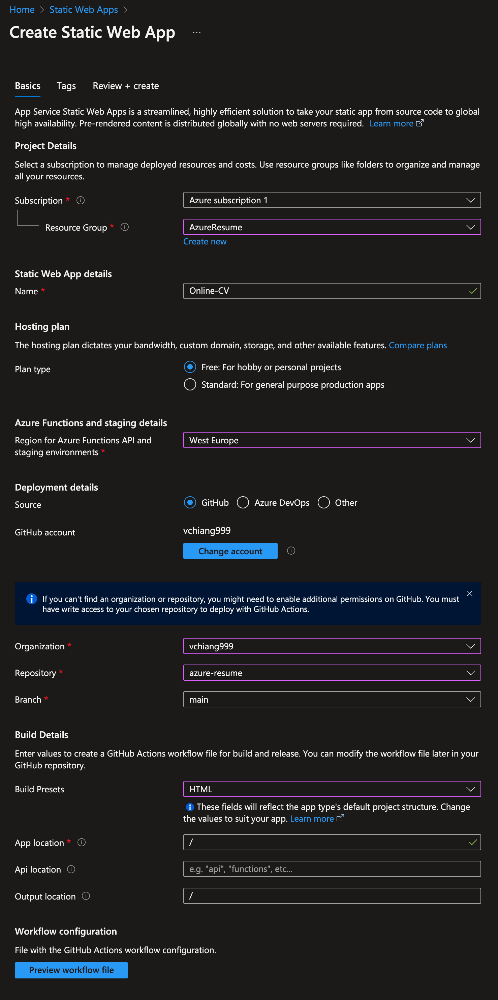
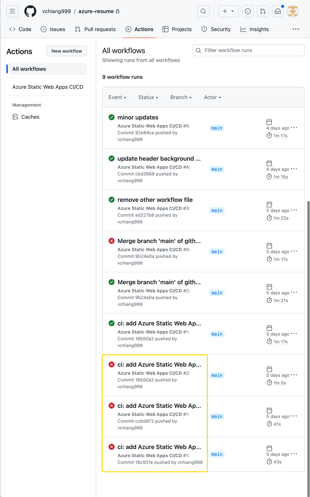
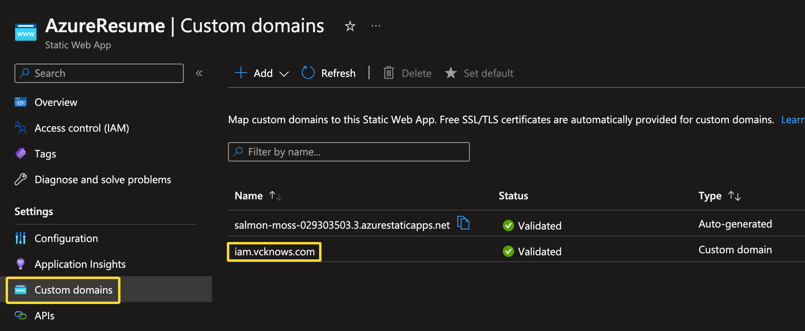

Summary: This marks the culmination of a transformative journey. During this exercise, I acquired valuable skills in utilizing GitHub and Visual Studio Code, and successfully setting up an Azure static web app. Moreover, I have become more familiar with terminal commands, utilising them to push codes to GitHub and review and update codes from Visual Studio Code for my CV template. This hands-on experience not only imparted practical knowledge but also deepened my understanding of the tools and technologies involved. As a result, I now feel confident and enthusiastic about applying these newfound skills to future projects.

🎉 This is my CV online! 🎉

Ok, it’s not that easy. Now that I have set up the necessary accounts, I am breaking it down into steps to show how I got it online.

##### I found these video particularly useful.
    From start to a fully working online CV
        https://www.youtube.com/watch?v=ieYrBWmkfno
    
    Reference to create and add SSH Key
        https://www.youtube.com/watch?v=8X4u9sca3Io

One of the immediate challenges is setting up SSH key. The purpose of adding SSH key to GitHub is to verify that you are the one pushing code and not someone else who might be malicious or otherwise.

Done adding SSH Key!

The unique SSH link to the repository

Connecting Visual Studio Code to GitHub repository

Setting Azure Static Web App and connect to GitHub repositoary.

It was not a smooth sail; as you can see, there were errors. After a few tries, I found the issue and the website is up and running!

Lastly, added a custom domain - [iam.vcknows.com](https://iam.vcknows.com) 😁

